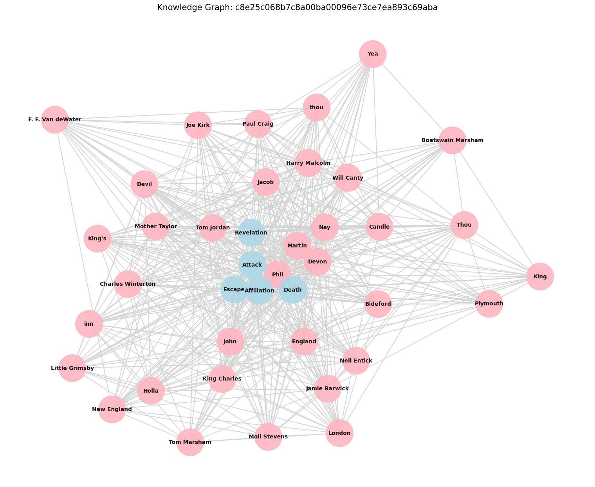

# Narrative QA with MMR Retrieval and Dynamic Graph Generation

### Overview
This project addresses the challenges of long-form narrative understanding by building a multi-modal retrieval system. Instead of relying solely on vector search, we construct a persistent **Static Knowledge Graph** for each book to track character relations and event causality, allowing for more grounded and context-aware answer extraction.

### Key Features
*   **Hybrid Retrieval**: Combines Dense (FAISS) and Sparse (BM25) search for high recall.
*   **Narrative Knowledge Graphs**: Structural representation of characters and event-triggers.
*   **Graph-Neighbor Expansion**: Uses the graph to pull in context that lacks direct keyword overlap.
*   **Temporal & Milestone Boosting**: Prioritizes chunks based on the story timeline.
*   **Generative Fallback**: High-precision recovery using Gemini-2.0 via OpenRouter.

### Pipeline Architecture
1.  **Preprocessing**: Text cleaning and hierarchical chunking.
2.  **Indexing**: Entity detection (NER), Coreference Resolution, and FAISS Vector construction.
3.  **Retrieval Cache**: Parallel candidate generation via Hybrid Search (Dense + Sparse).
4.  **Graph Reasoning**: Building a dynamic, query-specific graph to find character paths.
5.  **Answer Synthesis**: Symbolic phrase extraction with an LLM-gated fallback.

### Graph Component
The system builds a **Static Graph** (stored as `graph.graphml`) during indexing. During retrieval, it creates a **Dynamic Local Graph** to find "hidden" connections between query entities. This allows the system to answer questions about characters who are narratively connected but don't appear in the same text chunk.

### Example
Below is the structural heart of *"The Dark Frigate"*, showing character hubs (pink) and event milestones (blue):


### Installation
```bash
python3 -m venv venv
source venv/bin/activate
pip install -r requirements.txt
```

### Usage Instructions

#### 1. Indexing a New Book
To build the indexes and knowledge graph for a raw text:
```bash
PYTHONPATH=. ./venv/bin/python3 src/indexing/faiss_builder.py
PYTHONPATH=. ./venv/bin/python3 src/graph/builder.py
```

#### 2. Interactive QA
Run a single question through the full graph-aware pipeline:
```bash
PYTHONPATH=. ./venv/bin/python3 tests/interactive_story_test.py
```

#### 3. Scaling Evaluation (Baseline)
To run the 100-book benchmark across all 5 retrieval variants:
```bash
PYTHONPATH=. ./venv/bin/python3 tests/run_all_variants.py --num-books 100 --output-dir ./results_baseline
```

#### 4. LLM Comparison
Compare the system's reasoning against Gemini/Llama/DeepSeek:
```bash
PYTHONPATH=. ./venv/bin/python3 tests/compare_llms.py --num-books 25
```

### Project Structure
*   `src/nlp/`: NER, Coreference, and Entity Filtering.
*   `src/graph/`: Knowledge graph construction and reasoning algorithms.
*   `src/indexing/`: FAISS, BM25, and entity-to-chunk indexers.
*   `src/retrieval/`: The core engine: `hybrid_search.py`, `expansion.py`, and `answer.py`.
*   `src/config.py`: Global paths, model settings, and OpenRouter API config.

### Evaluation Results (100 Books)
| Variant | Exact Match (EM) | F1 Score |
| :--- | :--- | :--- |
| **Static Graph** 🏆 | **0.0290** | **0.0431** |
| **Hybrid (Dense+BM25)** | 0.0290 | 0.0423 |
| **Dense (Vector) Only**| 0.0247 | 0.0399 |

### Limitations
*   **Synonym Matching**: Symbolic patterns are sensitive to synonym variation (partially resolved by the LLM fallback).
*   **Graph Density**: Works best on character-driven narratives with frequent entity interactions.

### Future Work
*   Integration of **Universal Character Profiles** across the entire Gutenberg corpus.
*   Scaling to **Multi-hop reasoning** beyond 2 narrative steps.
